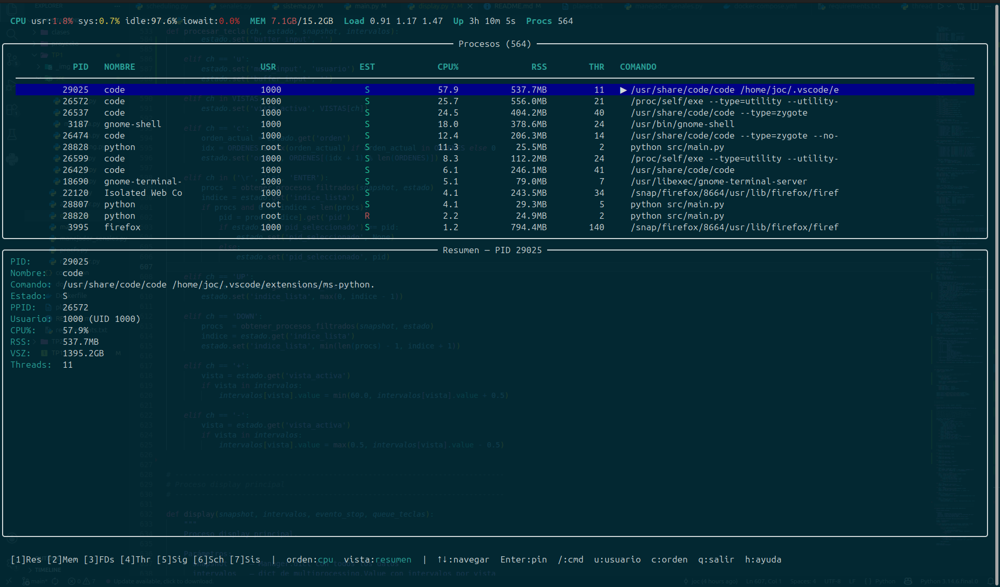
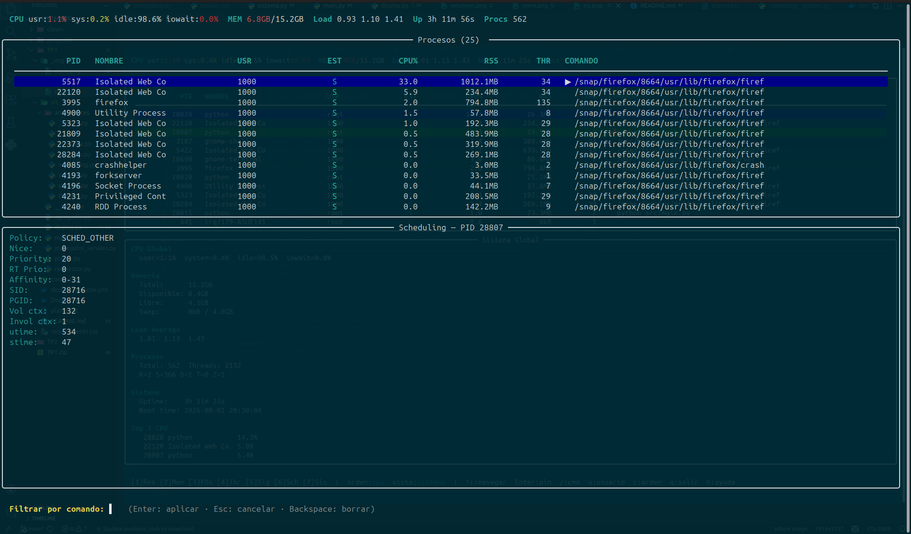
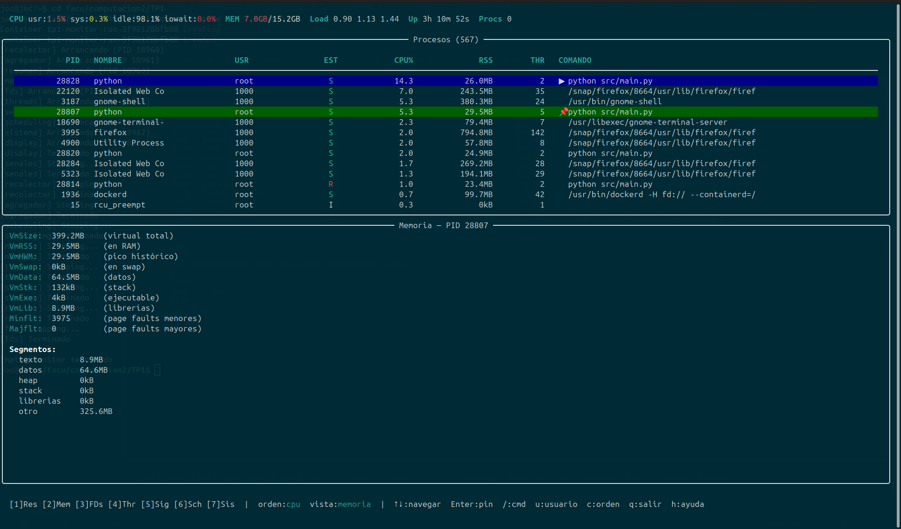
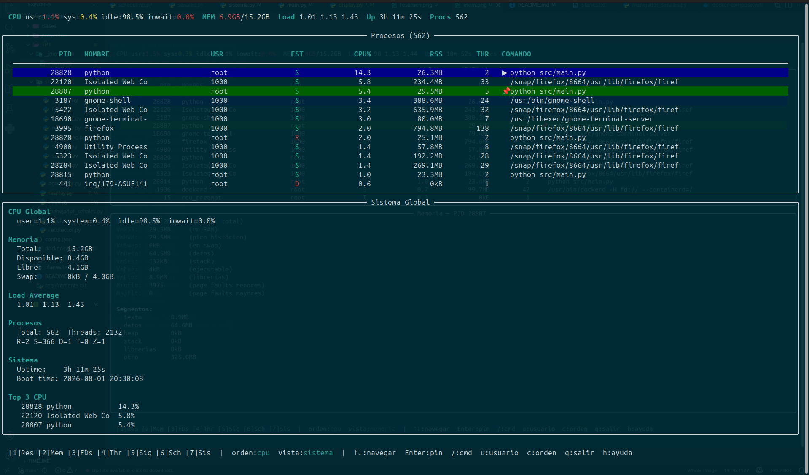

# Monitor de Procesos y Threads

**Computación II — Universidad de Mendoza — 2026**
**Alumno:** Josefina Porolli Serpa
**Legajo:** 64133

---

## Descripción general

Monitor del sistema en tiempo real similar a `htop`, con énfasis en mostrar la anatomía interna de cada proceso y sus threads. Toda la información se extrae leyendo `/proc` directamente, sin librerías que abstraigan el acceso al kernel.

El sistema es **multiproceso**: un recolector central lista los PIDs activos, los distribuye a 7 analizadores especializados que corren en paralelo, un agregador mantiene el snapshot global en memoria compartida, y un proceso de display renderiza la TUI en tiempo real.

### Cómo correr

```bash
git clone https://github.com/josefinaPorolli/computacion2
cd TP1
docker compose up --build
```

Para salir: presionar `q` dentro del monitor, o `Ctrl+C`.

### Keybindings

| Tecla | Acción |
|-------|--------|
| `1`/`r` | Vista Resumen |
| `2`/`m` | Vista Memoria |
| `3`/`f` | Vista File Descriptors |
| `4`/`t` | Vista Threads |
| `5`/`s` | Vista Señales |
| `6`/`p` | Vista Scheduling |
| `7`/`g` | Vista Sistema global |
| `↑` `↓` | Navegar por la lista de procesos |
| `Enter` | Pin/unpin del proceso seleccionado |
| `/` | Filtrar por nombre de comando |
| `u` | Filtrar por usuario |
| `c` | Cambiar orden (CPU% → RSS → PID) |
| `+` / `-` | Ajustar intervalo de la vista activa |
| `h` / `?` | Ayuda |
| `q` | Salir limpiamente |

### Cómo probar las señales

```bash
# En otra terminal, con el monitor corriendo:
docker ps                                    # ver nombre del contenedor
docker exec -it <nombre-contenedor> bash     # entrar al contenedor
pgrep -f "main.py" | head -1                # obtener PID del proceso principal

kill -SIGUSR1 <pid>   # dump del snapshot a dump_<timestamp>.json
kill -SIGHUP  <pid>   # recargar intervalos desde config.json
kill -SIGUSR2 <pid>   # toggle modo verbose
kill -SIGTERM <pid>   # apagado limpio
```

---

## Diagrama de arquitectura

```
                    ┌─────────────┐
                    │   main.py   │  proceso principal
                    │  (orquesta) │  lee teclas via readchar
                    └──────┬──────┘
                           │ lanza
          ┌────────────────┼────────────────────────────┐
          │                │                            │
   ┌──────▼──────┐  ┌──────▼──────┐            ┌──────▼──────┐
   │ recolector  │  │  agregador  │            │   display   │
   │  lista PIDs │  │ único que   │            │ renderiza   │
   │  cada 2s    │  │ escribe en  │            │    TUI      │
   └──────┬──────┘  │  snapshot   │            └─────────────┘
          │         └──────▲──────┘                   ▲
          │ Queue           │ Queue                    │ lee
          │ (PIDs)          │ (resultados)             │
    ┌─────▼──────────────────────────────────┐         │
    │           7 analizadores               │         │
    │  resumen  memoria  fds  threads        │         │
    │  senales  scheduling  sistema          │         │
    └────────────────────────────────────────┘         │
                                                        │
                    ┌───────────────────────────────────┘
                    │
             ┌──────▼──────────────────────┐
             │      SNAPSHOT GLOBAL        │
             │      (Manager.dict)         │
             │  resumen, memoria, fds,     │
             │  threads, senales,          │
             │  scheduling, sistema,       │
             │  top_cpu, top_mem           │
             └─────────────────────────────┘
```

### Flujo de datos completo

```
1. recolector lista /proc → obtiene lista de PIDs activos
2. manda la lista a cada analizador via su Queue individual
3. cada analizador lee /proc/<pid>/... para su sección
4. manda ('seccion', datos) al agregador via queue_agregador
5. agregador escribe en snapshot['seccion'] y actualiza top_cpu/top_mem
6. display lee el snapshot y renderiza la vista activa
7. main.py lee teclas y las manda al display via queue_teclas
8. señales del SO llegan a main.py via self-pipe y disparan acciones
```

---

## Composición de archivos y funciones

---

### `src/procfs.py` — La única puerta a `/proc`

Este es el archivo más importante del proyecto. Es el **único** que toca `/proc` directamente. Todos los analizadores importan desde acá en vez de leer `/proc` ellos mismos. Esto tiene una razón: si mañana cambia cómo se parsea algo, se arregla en un solo lugar.

Todas las funciones siguen la misma regla: si el proceso desaparece mientras lo estamos leyendo (cosa que pasa todo el tiempo en un sistema vivo), devuelven `None` en vez de crashear.

#### `listar_pids()`
Lista el contenido de `/proc` y filtra solo las entradas que son números. En Linux, cada carpeta numérica dentro de `/proc` corresponde a un proceso vivo. Por ejemplo, `/proc/1234/` significa que existe un proceso con PID 1234.

```
/proc/
  1/        ← proceso init (PID 1)
  2/        ← proceso kthreadd (PID 2)
  1234/     ← algún proceso de usuario
  cpuinfo   ← no es un proceso, lo ignoramos
  meminfo   ← no es un proceso, lo ignoramos
```

Devuelve una lista de enteros: `[1, 2, 1234, ...]`

#### `leer_stat(pid)`
Lee y parsea `/proc/<pid>/stat`. Es el archivo más denso de `/proc`: una sola línea con 52 campos separados por espacios, definidos en la man page del kernel (`man 5 proc`). Tiene los datos de tiempo de CPU, estado del proceso, scheduling, etc.

El truco complicado es el campo 2 (nombre del proceso), que viene entre paréntesis y puede contener espacios. Por ejemplo:
```
1234 (mi proceso raro) S 1 1234 ...
```
Si hiciéramos `split()` directo, los espacios del nombre romperían el parseo. La solución es buscar el primer `(` y el último `)` para extraer el nombre, y después splitear el resto.

Los índices que usamos (`resto[0]`, `resto[11]`, etc.) corresponden exactamente a los campos definidos en la man page. Por ejemplo, `utime` es el campo 14 de la man page, pero como parseamos los primeros dos campos (pid y nombre) por separado, en el array `resto` está en el índice 11.

#### `leer_status(pid)`
Lee y parsea `/proc/<pid>/status`. Es más legible que stat — formato `Clave: valor` en cada línea. Complementa stat con datos que stat no tiene: memoria detallada, UIDs completos, máscaras de señales, context switches.

Cada tipo de dato viene en un formato distinto y los parseamos por separado:
- Memoria: `"8192 kB"` → extraemos el número y descartamos `" kB"`
- UIDs/GIDs: `"1000 1000 1000 1000"` → cuatro números (real, efectivo, saved, filesystem)
- Threads, context switches: números simples

#### `leer_cmdline(pid)`
Lee `/proc/<pid>/cmdline`. Tiene el comando completo con todos los argumentos, a diferencia de stat que trunca el nombre a 15 caracteres. El kernel guarda los argumentos separados por caracteres nulos (`\x00`) en vez de espacios, porque los espacios son válidos dentro de nombres de archivo. Los convertimos a espacios para que sea legible.

Los procesos de kernel tienen `cmdline` vacío porque no fueron lanzados con un comando. Para esos mostramos el nombre entre corchetes, como hace `htop`: `[kworker/0:1]`.

#### `pid_existe(pid)`
Simplemente verifica si existe `/proc/<pid>`. Los analizadores lo llaman antes de leer un proceso para evitar errores si el proceso murió entre cuando el recolector lo listó y cuando el analizador lo va a leer.

#### `nombre_usuario(uid)`
Convierte un UID numérico (como `1000`) al nombre de usuario (como `joc`). Lee `/etc/passwd` directamente, sin usar la librería `pwd` de Python, para mantener la filosofía del proyecto de leer archivos del sistema a mano.

---

### `src/recolector.py` — El distribuidor de trabajo

El recolector es el primer proceso hijo que arranca. Su trabajo es simple: cada N segundos, toma una foto de qué procesos existen y se la manda a todos los analizadores.

#### `recolector(queues, intervalo, evento_stop)`
Recibe una lista de Queues (una por analizador) y un intervalo en segundos. Su loop hace tres cosas:
1. Chequea si le pidieron parar (`evento_stop`)
2. Llama a `listar_pids()` y manda el resultado a todas las queues
3. Duerme `intervalo` segundos

El `maxsize=1` de cada queue es importante: si un analizador todavía está procesando el snapshot anterior y no consumió la cola, el recolector simplemente descarta el nuevo en vez de acumular snapshots viejos en memoria.

El recolector no analiza nada. No sabe qué hay en `/proc/<pid>/stat`. Solo sabe que existen esos PIDs. Toda la inteligencia está en los analizadores.

---

### `src/agregador.py` — El único escritor del snapshot

El agregador es el guardián del snapshot global. Es el **único proceso que escribe en `snapshot`**. Todos los analizadores le mandan sus resultados y él los escribe ordenadamente.

#### `agregador(queue_agregador, snapshot, evento_stop)`
Su loop espera mensajes de la `queue_agregador`. Cada mensaje es una tupla `('nombre_seccion', datos)`. Al recibirlo:

1. Escribe `snapshot['nombre_seccion'] = datos`
2. Escribe `snapshot['nombre_seccion_ts'] = time.time()` — timestamp para que el display sepa cuándo se actualizó por última vez
3. Si la sección es `'resumen'`, recalcula `top_cpu` y `top_mem` ordenando todos los procesos

¿Por qué un solo escritor? Si los 7 analizadores escribieran al snapshot al mismo tiempo, podrían pisarse. El agregador serializa las escrituras: entran mensajes de a uno por la queue y se procesan de a uno.

Al apagarse, vacía lo que quede en la queue antes de terminar para no perder datos.

---

### `src/analizadores/resumen.py` — Datos básicos de cada proceso

#### `calcular_cpu(pid, stat_actual, lecturas_anteriores)`
CPU% no existe como dato en `/proc`. Hay que calcularlo midiendo cuántos jiffies (ticks internos del kernel) consumió el proceso en un intervalo de tiempo real.

La fórmula es:
```
CPU% = (utime_ahora + stime_ahora - utime_antes - stime_antes)
       / (tiempo_transcurrido * jiffies_por_segundo) * 100
```

Para esto guardamos la lectura anterior en el dict `lecturas_anteriores` con clave `pid`. La primera vez siempre da 0% porque no hay lectura anterior con qué comparar.

`utime` es el tiempo que el proceso pasó en modo usuario (corriendo código de la aplicación). `stime` es el tiempo en modo kernel (llamadas al sistema). La suma de los dos es el CPU total consumido.

#### `analizar_proceso(pid, lecturas_anteriores)`
Llama a `leer_stat()`, `leer_status()` y `leer_cmdline()` para un PID y arma un dict con todos los datos de resumen. Si el proceso murió mientras lo leemos, alguna de esas funciones devuelve `None` y esta función también devuelve `None`. El analizador principal lo ignora.

#### `resumen(queue_pids, queue_agregador, intervalo_val, evento_stop)`
El proceso hijo propiamente dicho. Su loop:
1. Espera PIDs de la queue del recolector
2. Llama a `analizar_proceso()` para cada PID
3. Limpia las lecturas anteriores de PIDs que ya no existen (para no acumular memoria)
4. Manda `('resumen', resultados)` al agregador
5. Duerme `intervalo_val.value` segundos — un `mp.Value` compartido que el display puede cambiar con `+`/`-`

---

### `src/analizadores/memoria.py` — Datos de memoria de cada proceso

#### `leer_maps(pid)`
Lee `/proc/<pid>/maps`. Este archivo tiene una línea por cada segmento de memoria virtual del proceso, con el rango de direcciones, permisos y nombre:

```
7f8b4a000000-7f8b4a200000 r-xp 00000000 fd:01 123  /usr/lib/libc.so.6
7fff12345000-7fff12367000 rw-p 00000000 00:00 0     [stack]
```

Agrupamos los segmentos en categorías calculando el tamaño de cada uno (dirección_fin - dirección_inicio, en hexadecimal) y clasificando por nombre y permisos:
- `[heap]` → heap
- `[stack]` → stack
- Archivos `.so` → librerías compartidas
- Segmentos con permiso `x` (ejecutable) → código del programa
- Segmentos con permiso `w` (escritura) sin nombre especial → datos

#### `analizar_memoria(pid)`
Combina `leer_status()` (para los campos Vm*), `leer_stat()` (para los page faults) y `leer_maps()` (para los segmentos agrupados) en un solo dict.

Los **page faults** son cuando el proceso accede a una página de memoria que no está disponible inmediatamente:
- Minor fault: la página existe pero no estaba mapeada. El kernel la resuelve sin ir al disco. Barato.
- Major fault: la página hay que traerla del disco. Caro. Muchos major faults indican un proceso con problemas de memoria.

---

### `src/analizadores/fds.py` — File descriptors abiertos

En Linux "todo es un archivo": no solo archivos del disco, sino también conexiones de red (sockets), comunicación entre procesos (pipes), terminales (tty), etc. Los file descriptors son los "handles" con los que un proceso accede a todo eso.

#### `inferir_tipo(destino)`
El destino de cada symlink en `/proc/<pid>/fd/` tiene patrones reconocibles:
- `socket:[12345]` → socket de red o Unix
- `pipe:[67890]` → pipe entre procesos
- `anon_inode:[eventfd]` → objeto anónimo del kernel (eventfd, epoll, etc.)
- `/dev/pts/0` → terminal (tty)
- `/dev/null`, `/dev/zero` → dispositivo
- `/home/joc/archivo.txt` → archivo regular

#### `leer_fds(pid)`
Lista `/proc/<pid>/fd/` — una carpeta llena de symlinks numerados, uno por cada FD abierto. Para cada symlink usa `os.readlink()` para ver a dónde apunta. Puede fallar con `PermissionError` si el proceso es de otro usuario; en ese caso lo ignora silenciosamente.

#### `analizar_fds(pid)`
Llama a `leer_fds()` y además cuenta cuántos FDs hay de cada tipo (cuántos sockets, cuántos pipes, etc.) para mostrar un resumen rápido en la tabla.

---

### `src/analizadores/threads.py` — Threads (LWPs) de cada proceso

En Linux los threads se llaman LWPs (Light Weight Processes) y tienen su propio TID (Thread ID). Cada proceso tiene al menos un thread — el thread principal, cuyo TID es igual al PID del proceso.

`/proc/<pid>/task/` contiene una subcarpeta por cada thread, con los mismos archivos que `/proc/<pid>/` pero específicos de ese thread.

#### `leer_thread_stat(pid, tid)` / `leer_thread_comm(pid, tid)` / `leer_thread_status(pid, tid)`
Leen `/proc/<pid>/task/<tid>/stat`, `/comm` y `/status` respectivamente. Son exactamente iguales a las funciones de proceso pero leen desde la subcarpeta del thread.

#### `analizar_threads(pid, lecturas_anteriores)`
Para cada thread del proceso, lee su estado, nombre y calcula su CPU% con el mismo método delta-de-jiffies que usamos para procesos. La clave en `lecturas_anteriores` es `(pid, tid)` — necesitamos ambos porque el mismo TID puede existir en procesos distintos.

Los **context switches involuntarios** son cuando el kernel interrumpe el thread a la fuerza porque se le acabó su tiempo de CPU. Un thread con muchos involuntarios es CPU-bound (quiere más CPU de la que le dan). Los **voluntarios** son cuando el thread cede la CPU él mismo, esperando I/O u otro evento.

---

### `src/analizadores/senales.py` — Máscaras de señales

#### `decodificar_mascara(hex_str)`
Las máscaras de señales en `/proc/<pid>/status` vienen como números hexadecimales de 64 bits donde cada bit representa una señal. El bit N-1 corresponde a la señal N.

Por ejemplo, `0000000000000006` en binario es `...0110`. Los bits 1 y 2 están seteados, lo que significa que las señales 2 (SIGINT) y 3 (SIGQUIT) están activas en esa máscara.

La función itera por el diccionario `NOMBRES_SENALES` y para cada señal chequea si su bit está seteado con `mascara & (1 << (num_senal - 1))`.

#### `analizar_senales(pid)`
Lee las cinco máscaras del proceso desde `/proc/<pid>/status`:
- `SigBlk`: señales bloqueadas temporalmente por el proceso
- `SigIgn`: señales que el proceso descarta siempre
- `SigCgt`: señales con handler propio (el proceso tiene código específico para manejarlas)
- `SigPnd`: señales enviadas al proceso pero todavía no procesadas
- `ShdPnd`: señales pendientes para todo el grupo de procesos

Guarda tanto el hexadecimal original (para el README) como la lista decodificada de nombres (para mostrar en la TUI).

---

### `src/analizadores/scheduling.py` — Configuración de scheduling

#### `analizar_scheduling(pid)`
Extrae de `stat` y `status` todo lo relacionado con cómo el kernel decide cuándo y por cuánto tiempo corre el proceso:

- **nice**: la "amabilidad" del proceso. De -20 (máxima prioridad, solo root) a 19 (mínima). Lo controla el usuario con el comando `nice` o `renice`.
- **priority**: lo que el kernel realmente usa. Empieza en `20 + nice` pero el kernel lo ajusta dinámicamente según el comportamiento del proceso.
- **policy**: la política de scheduling. `SCHED_OTHER` (0) es el default para procesos normales. `SCHED_FIFO` (1) y `SCHED_RR` (2) son para procesos de tiempo real.
- **rt_priority**: prioridad de tiempo real, solo relevante para FIFO y RR.
- **cpu_affinity**: en qué CPUs puede correr el proceso (de `Cpus_allowed_list`).
- **SID / PGID**: sesión y grupo de procesos, útiles para entender la jerarquía de procesos.

---

### `src/analizadores/sistema.py` — Stats globales del sistema

El único analizador que no mira procesos individuales sino el sistema completo.

#### `leer_cpu_global()`
Lee la línea `cpu` (sin número) de `/proc/stat`. Esta línea suma los jiffies de todos los cores. Como con los procesos, necesitamos dos lecturas para calcular el porcentaje: guardamos la anterior y en la siguiente calculamos el delta.

#### `leer_meminfo()`
Parsea `/proc/meminfo`. El campo más importante es `MemAvailable` — lo que realmente podés usar, incluyendo lo que está en buffers y cache y el kernel puede liberar. `MemFree` solo cuenta la RAM completamente vacía, que en Linux siempre es baja porque el kernel usa toda la RAM libre como cache de disco.

#### `leer_loadavg()`
Lee `/proc/loadavg`. El load average es cuántos procesos en promedio estuvieron queriendo usar CPU en el último 1, 5 y 15 minutos. Un load de 1.0 en un sistema de 4 cores significa que está al 25% de capacidad.

#### `leer_boot_time()`
Lee la línea `btime` de `/proc/stat`. Es el timestamp Unix del momento en que arrancó el sistema. Lo convertimos a fecha legible en el display.

#### `contar_estados(snapshot)`
Cuenta cuántos procesos hay en cada estado (R=running, S=sleeping, D=disk wait, T=stopped, Z=zombie) leyendo el snapshot de resumen. También suma el total de threads de todos los procesos.

---

### `src/manejador_senales.py` — Manejo de señales con self-pipe

El problema con los handlers de señales es que pueden interrumpir cualquier operación en cualquier momento. Si un handler intenta hacer algo complejo (escribir en el Manager, hacer I/O) podría interrumpir otra operación similar y causar un deadlock. Por eso los handlers tienen que ser **async-signal-safe**: solo pueden hacer operaciones simples garantizadas de no bloquear.

La solución es el patrón **self-pipe**: el handler solo escribe un byte en un pipe (operación async-signal-safe), y el loop principal lee ese pipe y ejecuta la acción real cuando puede.

Al arrancar, `os.pipe()` crea dos extremos: `_pipe_r` (lectura) y `_pipe_w` (escritura). El extremo de lectura se configura como no bloqueante con `fcntl` para que el loop principal pueda chequearlo sin quedarse trabado.

#### `instalar_handlers()`
Instala los cinco handlers con `signal.signal()`. Se llama desde `main.py` **antes** de lanzar los procesos hijos, para que los hijos hereden los handlers pero no el pipe — si un hijo recibe una señal, la ignora y solo el proceso principal la procesa.

#### `_handler_sigint/term/hup/usr1/usr2(signum, frame)`
Cada uno escribe un byte distinto en `_pipe_w`. Eso es todo. La acción real la hace `procesar_senales()`.

#### `procesar_senales(...)`
Se llama desde el loop principal cada 0.1 segundos. Intenta leer un byte del pipe con `os.read(_pipe_r, 1)`. Si no hay señales pendientes, lanza `BlockingIOError` (porque el pipe es no bloqueante) y retorna inmediatamente. Si hay un byte, ejecuta la acción correspondiente:
- `I` o `T` → `accion_shutdown()`: setea `evento_stop` para que todos los procesos terminen
- `H` → `accion_recargar_config()`: lee `config.json` y actualiza los `mp.Value` de intervalos
- `1` → `accion_dump_snapshot()`: serializa el snapshot a un archivo JSON con timestamp
- `2` → `accion_toggle_verbose()`: invierte `snapshot['verbose']`

---

### `src/display.py` — La interfaz de usuario

El proceso display tiene dos responsabilidades que corren al mismo tiempo: renderizar la pantalla y reaccionar a las teclas. Pero como `rich.Live` ocupa la terminal completa, no puede leer input directamente. La solución es que `main.py` lea las teclas y se las mande via `queue_teclas`.

#### `EstadoDisplay`
Clase que guarda todo el estado de la interfaz:
- `vista_activa`: qué pestaña está abierta (`'resumen'`, `'memoria'`, etc.)
- `indice_lista`: en qué fila está el cursor en la lista de procesos
- `pid_seleccionado`: si el usuario hizo pin con Enter, guarda el PID para que el panel de detalle no cambie aunque la lista se reordene
- `filtro_cmd` / `filtro_usuario`: filtros activos
- `orden`: cómo está ordenada la lista (`'cpu'`, `'rss'`, `'pid'`)
- `modo_ayuda`: si el panel de detalle está mostrando la ayuda
- `modo_filtro`: si el panel está mostrando el prompt de filtro
- `filtro_buffer`: el texto que está escribiendo el usuario en el modo filtro

Usa un `threading.Lock` interno para que el loop de renderizado y el thread de teclado no lean/escriban el estado al mismo tiempo.

#### `obtener_procesos_filtrados(snapshot, estado)`
Toma todos los procesos del snapshot, aplica los filtros activos y los ordena según `estado.orden`. La lista completa siempre está en el snapshot — esta función solo decide qué mostrar.

#### `render_barra_superior(snapshot)` / `render_lista_procesos(snapshot, estado)` / `render_barra_inferior(estado)`
Las tres zonas fijas de la pantalla. La barra superior muestra CPU, RAM, load y uptime desde `snapshot['sistema']`. La lista de procesos muestra los primeros N procesos de la lista filtrada con el cursor resaltado en azul y el proceso pineado en verde. La barra inferior muestra los keybindings.

#### `render_panel_detalle(snapshot, estado)`
La zona que cambia. Primero determina qué PID mostrar (el pineado, o el que está bajo el cursor). Después delega a la función de render de la vista activa. Si está en modo ayuda o modo filtro, muestra esos panels en cambio.

#### `render_vista_resumen/memoria/fds/threads/senales/scheduling/sistema()`
Cada una toma el PID (o el snapshot completo para sistema) y arma el `Panel` de `rich` con los datos correspondientes de su sección del snapshot.

#### `procesar_tecla(ch, estado, snapshot, intervalos)`
El corazón del manejo de input. Recibe strings normalizados (`'UP'`, `'DOWN'`, `'ENTER'`, `'ESC'`, `'BACKSPACE'`, o caracteres simples como `'q'`, `'1'`, `'/'`).

Tiene tres modos de operación:
1. **Modo ayuda**: cualquier tecla cierra la ayuda
2. **Modo filtro**: acumula caracteres en `filtro_buffer`, Enter confirma, ESC cancela
3. **Modo normal**: procesa todos los keybindings

#### `display(snapshot, intervalos, evento_stop, queue_teclas)`
El proceso display principal. Crea el `EstadoDisplay`, entra en el loop de `rich.Live` y en cada iteración:
1. Vacía todas las teclas pendientes en `queue_teclas` y las procesa
2. Renderiza la pantalla con `render_pantalla()`
3. Duerme 50ms

---

### `src/main.py` — El orquestador

El proceso principal. Es el único que tiene acceso directo a la terminal (TTY), razón por la cual también es el que lee el teclado.

#### `cargar_config(path)`
Lee `config.json` al arrancar y extrae los intervalos. Si el archivo no existe o está malformado, usa los valores por defecto hardcodeados. Esto permite que `SIGHUP` (recargar config) funcione: el usuario edita `config.json`, manda la señal, y los intervalos se actualizan en caliente.

#### `thread_teclas(queue_teclas, evento_stop)`
Un thread que lee teclas con `readchar.readkey()` y las normaliza antes de mandar a la queue. La normalización convierte los códigos de escape de las flechas (`\x1b[A`, `\x1b[B`) a strings simples (`'UP'`, `'DOWN'`), y trata el caso especial del ESC: `readchar` a veces "atrapa" el ESC junto con la tecla siguiente, así que lo separamos en dos eventos.

Corre en un **thread** (no proceso) porque necesita acceso al mismo stdin que el proceso principal.

#### `main()`
1. Crea el `Manager` y el `snapshot` compartido
2. Instala los handlers de señales
3. Instala `SIGWINCH` para que la terminal se repinte al redimensionarse
4. Lee `config.json` con `cargar_config()`
5. Crea todas las Queues y Values
6. Lanza los 10 procesos hijos (recolector + agregador + 7 analizadores + display)
7. Lanza el thread de teclado
8. Entra en el loop principal que llama a `procesar_senales()` cada 0.1 segundos
9. En el `finally`: setea `evento_stop`, espera que cada proceso termine (join → terminate → kill), apaga el Manager

---

## Librerías utilizadas

### Stdlib (sin instalación)

| Librería | Para qué se usa en este proyecto |
|----------|----------------------------------|
| `os` | `os.listdir('/proc')` para listar PIDs, `os.readlink()` para leer FDs, `os.pipe()` para el self-pipe, `os.sysconf('SC_CLK_TCK')` para obtener los jiffies por segundo del sistema |
| `signal` | `signal.signal()` para instalar handlers de SIGINT, SIGTERM, SIGHUP, SIGUSR1, SIGUSR2, SIGWINCH |
| `multiprocessing` | `Process` para lanzar analizadores, `Queue` para comunicar PIDs y resultados, `Manager` y su `.dict()` para el snapshot compartido, `Value('d', ...)` para los intervalos ajustables, `Event` para coordinar el shutdown |
| `threading` | `Thread` para el thread de teclado en main.py, `Lock` dentro de `EstadoDisplay` para proteger el estado de la UI |
| `time` | `time.sleep()` en todos los loops, `time.time()` para timestamps de las secciones del snapshot y el nombre del dump JSON |
| `json` | `json.load()` en `cargar_config()` y `accion_recargar_config()`, `json.dump()` en `accion_dump_snapshot()` |
| `fcntl` | `fcntl.fcntl(_pipe_r, fcntl.F_SETFL, flags | os.O_NONBLOCK)` para hacer el extremo de lectura del self-pipe no bloqueante |
| `datetime` | `datetime.fromtimestamp(boot_time)` para mostrar la fecha de arranque del sistema en la vista Sistema |

### Externas (`requirements.txt`)

| Librería | Versión | Para qué se usa |
|----------|---------|-----------------|
| `rich` | 13.7.1 | `Live` para actualizar la pantalla sin parpadeo, `Layout` para dividir la pantalla en 4 zonas, `Table` para la lista de procesos y las vistas de FDs/threads, `Panel` para los paneles con bordes, `Text.from_markup()` para texto con colores usando sintaxis `[color]texto[/color]` |
| `readchar` | 4.0.5 | `readchar.readkey()` para leer teclas individuales sin esperar Enter, compatible con la terminal real del proceso principal |

---

## Decisiones de diseño

### ¿Por qué `Manager.dict` y no `Value`/`Array` para el snapshot?

El snapshot contiene datos heterogéneos y anidados: dicts de dicts, listas de dicts, con estructura que cambia según qué procesos existen. `Value` y `Array` solo pueden guardar tipos C simples (`int`, `float`, arrays de chars). `Manager.dict` puede guardar cualquier objeto Python serializable, lo que permite que cada analizador escriba su sección con la estructura que necesita sin coordinación extra.

Usamos `mp.Value('d', 2.0)` para los intervalos porque ahí sí es un solo número flotante que cambia frecuentemente — exactamente el caso de uso de `Value`.

### ¿Por qué un agregador como único escritor?

Si los 7 analizadores escribieran directamente en el snapshot al mismo tiempo, podría haber race conditions: dos procesos modificando el mismo dict compartido simultáneamente. El agregador serializa todas las escrituras — entran mensajes de a uno por la queue y se escriben de a uno. Esto elimina la necesidad de locks explícitos sobre el snapshot.

### ¿Por qué Queue y no Pipe para distribuir PIDs?

El recolector manda la misma lista de PIDs a 7 destinos distintos. `Pipe` es punto a punto (un emisor, un receptor). El `maxsize=1` de las Queues actúa como backpressure: si un analizador va lento, el recolector descarta el snapshot nuevo en vez de acumular snapshots viejos en memoria.

### ¿Por qué el patrón self-pipe para señales?

Los handlers de señales no pueden hacer operaciones complejas (acceder al Manager, hacer I/O) porque pueden interrumpir cualquier otra operación y causar deadlocks. El self-pipe permite que el handler solo haga `os.write()` (async-signal-safe) y el loop principal haga el trabajo real cuando puede hacerlo de forma segura.

### ¿Por qué los intervalos elegidos por defecto?

Cada analizador corre en su propio loop y "duerme" un intervalo distinto entre lectura y lectura de `/proc`, en vez de leer todo constantemente. Elegí un intervalo más corto para los datos que cambian rápido y quiero ver casi en tiempo real, y uno más largo para los que son costosos de leer o cambian poco:

- **`resumen` (2s), `threads` (2s), `sistema` (2s)**: son las vistas que más cambian y las que más se consultan (CPU%, memoria, cantidad de threads), así que necesitan refresco rápido para que el monitor se sienta "en vivo".
- **`memoria` (3s)**: cambia un poco más lento que el resumen y leer los segmentos de memoria de cada proceso es más costoso, así que le doy un poco más de margen.
- **`fds` (5s)**: recorrer `/proc/<pid>/fd` de todos los procesos implica hacer `readlink` de cada file descriptor, que es una operación más pesada. Los file descriptors tampoco cambian tan seguido, así que no hace falta refrescarlos cada 2 segundos.
- **`senales` (10s) y `scheduling` (10s)**: son los datos que menos cambian y los que menos consulto en el uso normal del monitor, así que los dejo con el intervalo más largo para no gastar CPU de más en algo que casi no se mira.

Además, cada intervalo tiene un `intervalo_minimo` en `config.json` para que, aunque el usuario lo achique con la tecla `-`, no pueda bajar tanto como para saturar la CPU del contenedor leyendo `/proc` sin parar.

### ¿Cómo se manejan las race conditions?

- **Snapshot**: un solo escritor (el agregador) elimina races sobre el dict compartido
- **Estado del display**: `EstadoDisplay` usa `threading.Lock` para que el loop de renderizado y el thread de teclado no accedan al estado al mismo tiempo
- **Lecturas de /proc**: si un proceso muere mientras lo leemos, `procfs.py` captura `FileNotFoundError` y `ProcessLookupError` y devuelve `None` — el analizador lo ignora

---

## Conceptos del curso aplicados

**Clase 1-2 — Docker**: todo el proyecto corre containerizado. El `Dockerfile` arma una imagen con Python y las dependencias de `requirements.txt`, y el `docker-compose.yml` define el servicio y el modo de ejecución (hay que usar `run --rm` en vez de `up` para que el contenedor tenga acceso a la terminal y pueda leer el teclado). Contenerizarlo asegura que el monitor lea siempre el `/proc` del mismo entorno controlado, sin depender de qué tenga instalado la máquina host.

**Clase 3 — Anatomía de /proc**: toda la capa `procfs.py` aplica este concepto directamente. `leer_stat()` parsea los 52 campos de `/proc/<pid>/stat` tal como los define la man page del kernel. `leer_status()` extrae las máscaras de señales y los campos de memoria.

**Clase 4 — fork, exec, wait, zombies**: en la vista Sistema, el campo `Z` del conteo de estados detecta procesos zombie leyendo el campo 3 de `/proc/<pid>/stat`. Un zombie es un proceso terminado cuyo padre todavía no llamó a `wait()`. `main.py` usa `p.join()` para hacer `wait()` sobre sus hijos al apagarse, evitando que el propio monitor cree zombies.

**Clase 5 — Pipes e IPC**: las `Queue` de `multiprocessing` están implementadas sobre pipes del SO. El self-pipe del manejador de señales usa `os.pipe()` directamente. La arquitectura completa (recolector → analizadores → agregador → display) es IPC via queues.

**Clase 6 — Señales y self-pipe**: `manejador_senales.py` implementa exactamente el patrón self-pipe. Los handlers solo hacen `os.write()` al pipe (async-signal-safe) y `procesar_senales()` lee el pipe en el loop principal con el extremo configurado como no bloqueante via `fcntl`.

**Clase 7 — Memoria compartida**: el `Manager.dict()` es memoria compartida entre todos los procesos. Los `mp.Value('d', ...)` para los intervalos también son memoria compartida, permitiendo que el display cambie el intervalo de un analizador en tiempo real sin reiniciarlo.

**Clase 8-9 — Multiprocessing**: toda la arquitectura usa `mp.Process`, `mp.Queue`, `mp.Manager`, `mp.Value` y `mp.Event`. El `evento_stop` coordinado permite shutdown limpio de todos los procesos.

**Clase 10 — Threading y GIL**: el thread de teclado en `main.py` y el `EstadoDisplay` con su `threading.Lock` aplican sincronización entre threads. Los analizadores son procesos (no threads) precisamente para evitar el GIL en el trabajo de parseo de `/proc` — si fueran threads, solo uno correría a la vez.

**Clase 11 — Sincronización**: el `threading.Lock` de `EstadoDisplay` es el ejemplo directo de este concepto: protege el estado compartido de la UI (proceso pineado, filtro activo, orden actual) para que el thread de teclado y el loop de renderizado no lo lean/escriban al mismo tiempo y produzcan datos inconsistentes en pantalla. A nivel de procesos, el `evento_stop` (`mp.Event`) sincroniza el apagado: todos los procesos hijos consultan la misma bandera compartida para saber cuándo terminar su loop, en vez de que cada uno decida por su cuenta.

---

## Limitaciones conocidas

- **Procesos de kernel**: los threads del kernel (kworker, ksoftirqd, etc.) tienen `cmdline` vacío y `/proc/<pid>/fd` restringido. Aparecen con FDs vacíos y sin segmentos de memoria. Es una limitación del SO, no del monitor.
- **Permisos**: algunos procesos de otros usuarios tienen `/proc/<pid>/fd` restringido. El monitor los ignora silenciosamente con `PermissionError`.
- **CPU% en primer ciclo**: la primera lectura siempre da 0% porque el cálculo requiere dos lecturas con un intervalo entre ellas.
- **Dump dentro del contenedor**: `SIGUSR1` guarda el JSON en `/app/dump_<timestamp>.json` dentro del contenedor, no en el host. Para sacarlo hay que usar `docker cp`.
- **`docker compose up` vs `docker compose run`**: con `up` el contenedor no recibe el input del teclado correctamente. Usar siempre `docker compose run --rm monitor`.
- No pude implementar la lectura de teclado para las funcionalidades que implican cambiar de vista o moverse en el monitor de forma nativa como pensé implementarlo en un primer momento, por lo que tuve que usar `readchar`.

---

## Lo que aprendí

Aprendí cómo implementar todas o al menos la gran mayoría de las cosas vistas en el curso en el semestre hasta ahora. Pude empezar a entender mejor cómo se manejan los procesos y sus hilos en mi computadora, además de otros conceptos que personalmente me quedaron en la cabeza de la materia Sistemas Operativos. Al momento de rendir dicha materia en el final, no me costó entender cómo funcionaban de forma teórica, pero nunca había implementado ninguna de estas cosas en la práctica. Este proyecto me ayudó mucho con el tema de la experiencia práctica, además de una profundización de la teoría.

Además, aprendí que desde un lenguaje tan simple y de alto nivel como lo es Python, se puede hacer algo que jamás se me habría ocurrido hacer. Siempre pensé en aplicaciones más "genéricas" como las de una aplicación comercial de las que se encuentran en prácticamente cualquier parte de internet. No sabía de la existencia de todas estas funcionalidades de Python hasta que empecé a cursar la materia y en definitiva me parece un recurso sumamente necesario para el desarrollo, ya que siempre podemos evaluar el rendimiento de alguna aplicación que estemos desarrollando, así como evaluar las condiciones del dispositivo y el rendimiento de los procesos.

---

## Capturas de pantalla




